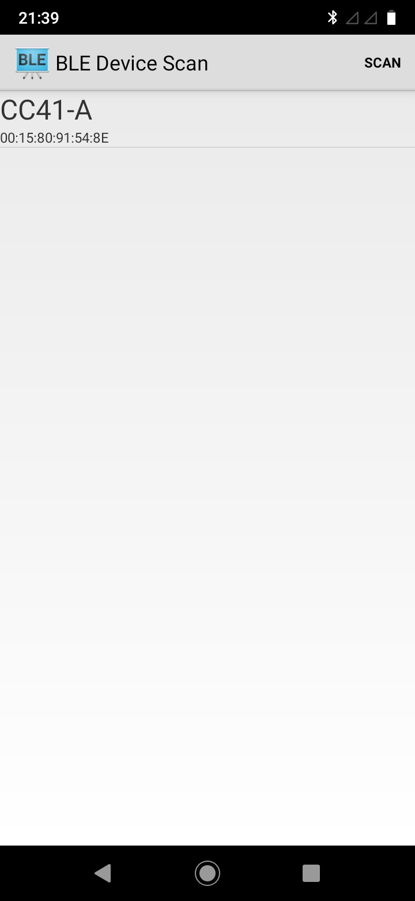
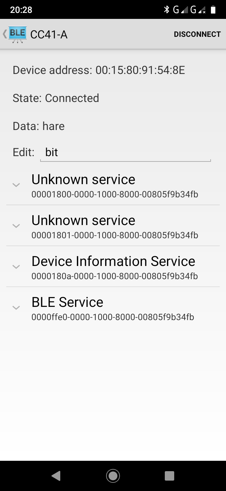
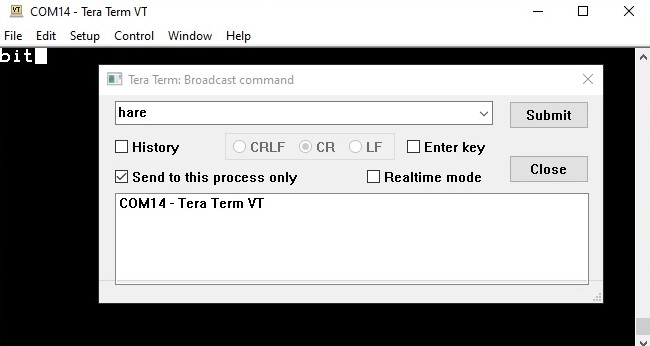

Android BluetoothLeGattTerminal
=================================
This is an adaption of Android BluetoothLeGatt sample to the CC41-A Bluetooth 4.0 module. The Terminal app can read and write.

The original is on
https://github.com/android/connectivity-samples/tree/master/BluetoothLeGatt

There are three add-on in the app

1. **write methode** in BluetoothLeService.java

2. **EditText**  in gatt_services_characteristics.xml und DeviceControlActivity.java

3. **location permission** treatment in DeviceScanActivity.java

Use the compare-with-function in Android Studio to find out the changes

Screenshots
-------------

Scan

 
Terminal

 
TeraTerm

Installation

harebit